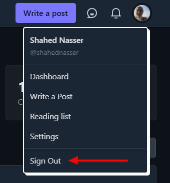
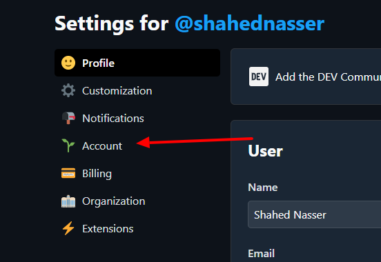
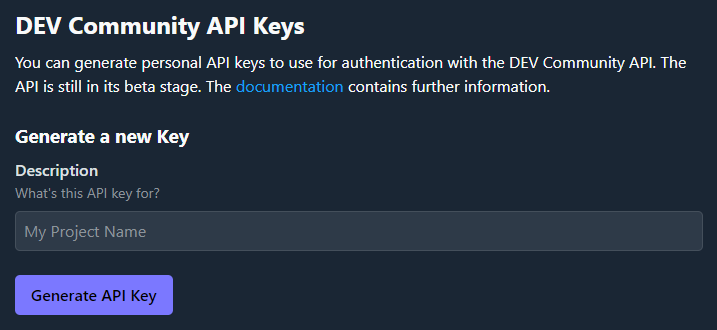
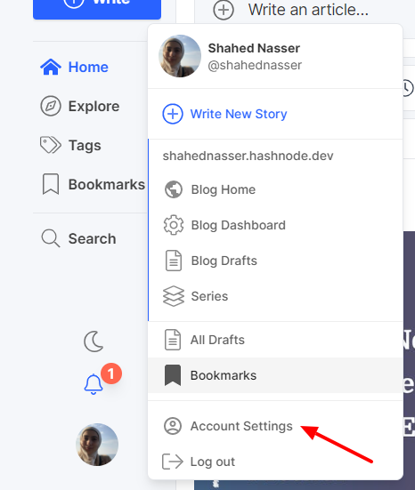
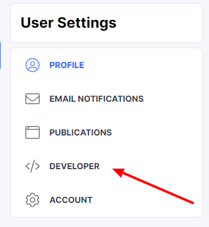
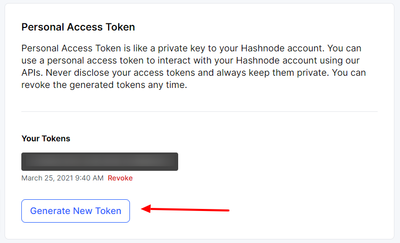
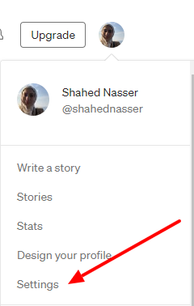
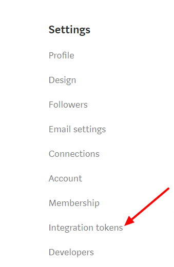
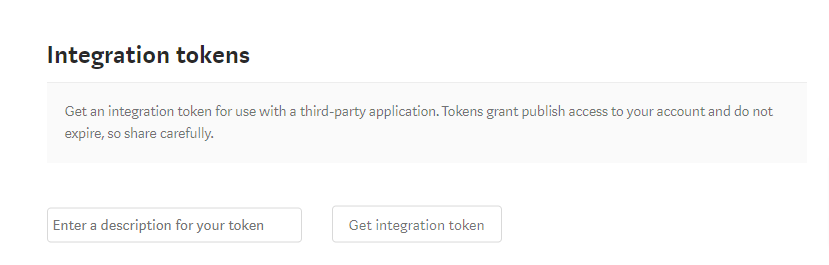

# Set Configuration


- [Set Configuration](#set-configuration)
    - [dev.to](#devto)
    - [Hashnode](#hashnode)
    - [Medium](#medium)

For the simplicity of the CLI, and considering most of the APIs of each of the platforms do not allow or provide endpoints for user authentication, you will need to get your access tokens, api keys or integration tokens from your own profile before using cross post. This will just need to be done the first time or if you want to change the tokens.

**The tokens are all stored on your local machine.**

Here's a guide on how to do this for each of the platforms:

### dev.to

1. After logging into your account on dev.to, click on your profile image and then click on Settings

   

2. Then, click on the Accounts tab in the sidebar

   

3. Scroll down to the "DEV Community API Keys" section. You need to generate a new key. Enter "Cross Post" in the description text box or any name you want then click "Generate API key"

   

   Copy the generated API key, then in your terminal:

   ```bash
   cross-post config dev
   ```

   You'll be prompted to enter the API key. Paste the API key you copied earlier and hit enter. The API key will be saved.

### Hashnode

1. After logging into your account on Hashnode, click on your profile image and then click on "Account Settings"

   

2. In the sidebar click on "Developer"

   

3. Click the "Generate" button and then copy the generated access token.

   

4. Run the following in your terminal:

    ```bash
    cross-post config hashnode
    ```

   First you'll be prompted to enter your access token. Then, you need to enter your Hashnode username. The reason behind that is that when later posting on hashnode your publication id is required, so your username will be used here to retreive the publication id. Once you do and everything goes well, the configuration will be saved successfully.

### Medium

1. After logging into Medium, click on your profile image and then click on "Settings"

   

2. Then click on "Integration Tokens" in the sidebar

   

3. You have to enter description of the token then click "Get integration token" and copy the generated token.

   

4. In your terminal run:

    ```bash
    cross-post config medium
    ```

   Then enter the integration token you copied. A request will also be sent to Medium to get your authorId as it will be used later to post your article on Medium. Once that is done successfully, your configuration will be saved.